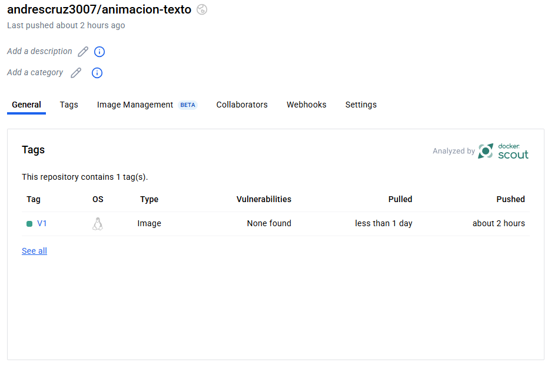

## 🧑‍🎓 Autores Grupo 5

- Calvera Chaparro Yesith Alonso 👾
- Gutierrez Florez Alfredo Jose 🪗
- Cruz Rojas Andres Felipe 🤖
- Mena Vargas Yeikin Andres 🪖
- Rodriguez Arguello Angel Eduardo 👑

---
# Scout⌨️️
Scout es una herramienta que ayuda a detectar vulnerabilidades y gestionar la seguridad de los contenedores

## Ejecucion SCOUT a traves de comandos

## Paso 1: Instalar Scout

Primero, asegúrase de tener SCOUT instalado en la máquina. Si no esta instalado, se puede instalarlo desde su página oficial o ejecutando:


``` bash
curl -sL https://get.scout.sh | sudo bash
```


## Paso 2: Descargar el contenedor de Docker Hub

Asegúrate de tener el contenedor "maquinaescribir" descargado desde Docker Hub. Puedes hacerlo con el siguiente comando:


``` bash
docker pull dockermena/maquinaescribir
```

## Paso 3: Ejecutar Scout sobre el contenedor

Una vez que SCOUT esté instalado y tengas el contenedor de Docker, puedes ejecutar SCOUT sobre el contenedor para analizarlo. El comando para analizar un contenedor con SCOUT es:

``` bash
scout scan --image dockermena/maquinaescribir
```

## Ejecucion SCOUT a traves de Docker hub

## Paso 1: Iniciar sesion

Para habilitar Docker Scout en tu repositorio de Docker Hub:

1. Inicia sesión en Docker Hub.

2. Selecciona la organización que contiene el repositorio "maquinaescribir".

3. Abre el repositorio y ve a la pestaña "Settings".
   


5. En "Image insight settings", activa "Advanced image analysis with Docker Scout"


.png)


Una vez activado, Docker Scout comenzará a analizar automáticamente las imágenes del repositorio.
