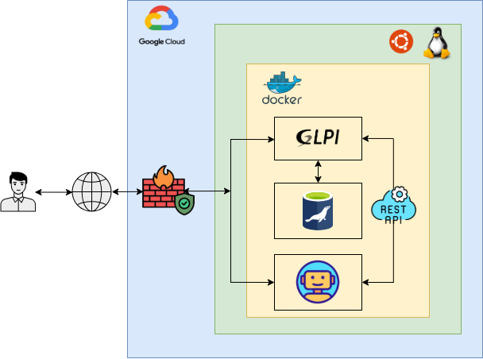
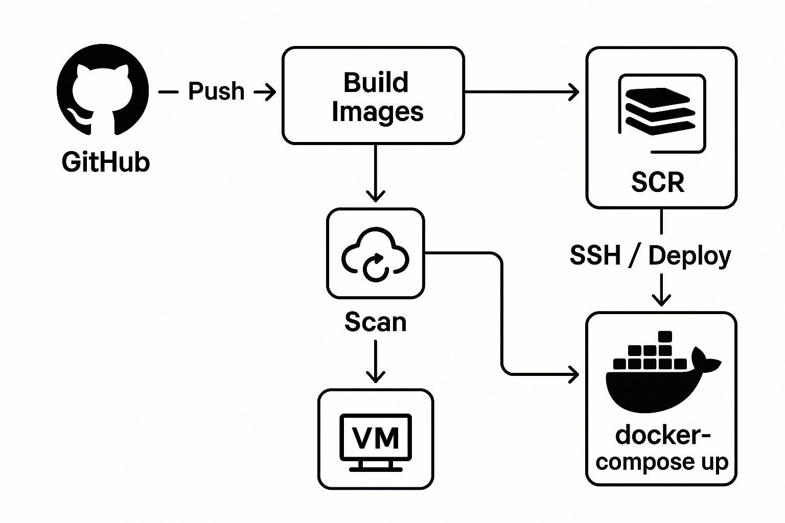

<h1 align="center">🔐 Proyecto DevSecOps: GLPI + MariaDB + Telegram Bot</h1>

<p align="center">
  
  
  
  
  
</p>

---

## Descripción del Proyecto

Este proyecto implementa una solución de gestión de tickets basada en GLPI, una base de datos MariaDB, y un microservicio de bot de Telegram conectado vía API REST. Toda la solución está dockerizada y desplegada en Google Cloud Platform (GCP), integrando seguridad en cada fase del ciclo de vida del desarrollo.

---

## 🔍 1. Fase de Planificación y Diseño

La fase de planificación y diseño establece las bases del proyecto, definiendo los objetivos, alcance, roles y requisitos funcionales y de seguridad desde el inicio (Shift Left). En esta etapa se diseñan las arquitecturas técnica y de seguridad, se modelan amenazas y se determinan las políticas que regirán la gestión del riesgo, garantizando que la seguridad esté integrada en todo el ciclo de vida del sistema.

<details>
<summary><b>Project Charter</b></summary>


## 1. Objetivos
  ### Objetivo General

  Desplegar una plataforma de gestión de soporte basada en GLPI (v10.0.18) en una instancia de GCP, conectada a una base de datos MariaDB y a un microservicio de bot de Telegram que permita consultar tickets.

  ### Objetivos Especificos
    1. Implementar un entorno contenerizado con Docker y Docker Compose para la orquestación completa de servicios en una instancia de **Google Cloud Platform (GCP)**.
    2. Permitir que los usuarios consulten casos mediante el chatbot y reciban asistencia automática a través de la conexión con GLPI.
    3. Asegurar el entorno con mecanismos de control de acceso robustos, desde el diseño del sistema.
    4. Asegurar el entorno con buenas prácticas **DevSecOps**, incluyendo análisis de vulnerabilidades, escaneo de imágenes y uso de variables seguras.

## 2. Roles del Proyecto

  - **Desarrollador Backend**: Encargado de la lógica del chatbot, conexión con GLPI y control de la base de datos.
  - **Ingeniero DevOps**: Responsable de contenerización con Docker, integración y despliegue.
  - **Especialista en Seguridad**: Garantiza el cumplimiento de requisitos de seguridad (autenticación, cifrado, control de acceso).

## 3. Alcance del Proyecto

### 3.1 Sí incluye:

  - Despliegue mediante Docker Compose.
  - Instalación automática desde el repositorio oficial de GLPI.
  - Integración con bot de Telegram como interfaz de consulta.
  - Proceso automatizado mediante CI/CD en GitHub Actions.
  - Seguridad y buenas prácticas DevSecOps incluidas.
  - Seguridad básica (tokens, firewalls, control de acceso).

### 3.2 No incluye:

  - Escalado automático a múltiples instancias.
  - Integración con plataformas diferentes a Telegram.
  - Soporte para múltiples idiomas del bot (fase futura).

### 3.3 Métricas de Éxito

  - 100% de los casos creados por Telegram se reflejan correctamente en GLPI.
  - Tiempo promedio de respuesta del bot < 2 segundos.
  - Tasa de error del chatbot < 5% en generación de tickets.
  - Implementación sin vulnerabilidades críticas detectadas (según escaneo de seguridad).
  - Accesos no autorizados bloqueados en ambiente de prueba (según logs de firewall).

## 4. Requisitos de Seguridad (Shift Left)

### 4.1 Desde el diseño:

  - Validación de entrada/salida entre bot y GLPI.
  - Comunicación cifrada (uso de tokens).

### 4.2 Durante el desarrollo:

  - Análisis de dependencias con herramientas como Trivy o Snyk.
  - Analsis con Docker Scode.
  - Revisión de código (linters, escáneres de vulnerabilidades).

### 4.3 Antes del despliegue:

  - Auditoría de roles y accesos. Usuarios y Tokens Agregar Tabla 
  - Políticas de red seguras (puertos mínimos abiertos). Firewall de Google Cloud Plattform 
  Agregar evidencia
  
### 4.4 En ejecución:

  - Monitoreo con alertas de acceso sospechoso. (Monitoreo de Firewall GCP)


</details>
<details>
<summary><b>Politicas y Estrategias de Seguridad</b></summary>

## Políticas de seguridad aplicables


Con el fin de garantizar los principios de seguridad (Confidencialidad, Integridad y Disponibilidad) sobre toda la solución, se adoptan un conjunto de normas y buenas prácticas recomendadas a nivel internacional.


### 1. ISO/IEC 27001:2022 – Sistema de Gestión de Seguridad de la Información (SGSI)

Marco que incluye requisitos relacionados con el análisis de riesgos, control de accesos y seguridad desde el inicio (Integración y despliegue continuo).

#### Controles técnicos del anexo A:


1. **A 14.3 Gestión de la seguridad en los ciclos de vida de los sistemas de información**  
   - **Aplicable a:** Control de versiones de código fuente de GLPI  
   - **Recomendación:** Documentar cambios del código a través de GitHub.

2. **A 14.2 – Desarrollo seguro de aplicaciones**  
   - **Aplicable a:** Código fuente de GLPI, API Rest y ChatBot.  
   - **Recomendación:** Validación del código fuente, librerías y dependencias a través de xxxx (Sonar, Snyk).


### 2. ISO/IEC 27005:2018 Gestión de riesgos

Marco metodológico para la identificación, análisis y tratamiento de riesgos. Se aplica en conjunto con Magerit.


### 3. MAGERIT – Metodología de Análisis y gestión de riesgos de los sistemas de información

Metodología española que incluye la identificación de activos, amenazas, vulnerabilidades, evaluación, tratamiento y seguimiento de riesgos.

---

## Metodología seleccionada: MAGERIT

MAGERIT (Metodología de Análisis y Gestión de Riesgos de los Sistemas de Información) se utiliza para estructurar el análisis de riesgos mediante la identificación de activos, amenazas e impactos.

De acuerdo con esta metodología se detallan las fases de la gestión de riesgos:

---

## 1. Identificación de Activos

### 1.1 Inventario de Activos
<div align="center">

| Nombre de Activo       | Tipo de Activo   | Descripción                          |
|------------------------|------------------|--------------------------------------|
| GLPI                   | Aplicación       | Sistema de gestión de tickets        |
| Base de datos MariaDB  | Datos/Información| Base de datos de GLPI                |
| Google Cloud           | Infraestructura  | Nube pública                         |
| Contenedores Docker    | Plataforma       | Entorno de ejecución contenerizado   |
| API REST               | Servicio         | Integración con servicios externos   |
| ChatBot                | Aplicación       | Aplicación para comunicación         |

</div>

### 1.2 Valoración de Activos

### GLPI

<div align="center">

| Impacto / Principio   | Confidencialidad | Integridad | Disponibilidad |
|-----------------------|------------------|------------|----------------|
| Económico             | Media            | Alta       | Alta           |
| Legal y regulatorio   | Alta             | Alta       | Media          |
| Reputacional          | Media            | Alta       | Alta           |
| Operacional           | Media            | Alta       | Alta           |

</div>

### Base de Datos MariaDB

(Idéntica valoración que GLPI)

### Google Cloud

<div align="center">

| Impacto / Principio   | Confidencialidad | Integridad | Disponibilidad |
|-----------------------|------------------|------------|----------------|
| Económico             | Media            | Alta       | Alta           |
| Legal y regulatorio   | Media            | Alta       | Media          |
| Reputacional          | Media            | Alta       | Alta           |
| Operacional           | Media            | Alta       | Alta           |

</div>

### Contenedores Docker

<div align="center">

| Impacto / Principio   | Confidencialidad | Integridad | Disponibilidad |
|-----------------------|------------------|------------|----------------|
| Económico             | Media            | Alta       | Alta           |
| Legal y regulatorio   | Bajo             | Media      | Media          |
| Reputacional          | Media            | Media      | Alta           |
| Operacional           | Media            | Alta       | Alta           |

</div>

### API REST

<div align="center">

| Impacto / Principio   | Confidencialidad | Integridad | Disponibilidad |
|-----------------------|------------------|------------|----------------|
| Económico             | Media            | Media      | Media          |
| Legal y regulatorio   | Alta             | Alta       | Media          |
| Reputacional          | Media            | Media      | Media          |
| Operacional           | Media            | Alta       | Alta           |

</div>

### ChatBot

<div align="center">

| Impacto / Principio   | Confidencialidad | Integridad | Disponibilidad |
|-----------------------|------------------|------------|----------------|
| Económico             | Bajo             | Media      | Bajo           |
| Legal y regulatorio   | Media            | Media      | Bajo           |
| Reputacional          | Media            | Media      | Bajo           |
| Operacional           | Media            | Media      | Bajo           |

</div>

---

## 2. Identificación y Evaluación de Riesgos

### 2.1 Identificación de Riesgos y Vulnerabilidades

<div align="center">

| Amenaza              | Activo Afectado     | Vulnerabilidad                           |
|----------------------|---------------------|-------------------------------------------|
| Acceso no autorizado | GLPI                | Ausencia de doble factor de autenticación |
| Pérdida de datos     | Base de datos MariaDB | Fallo de configuración o backup         |
| Fallo de contenedores| Contenedores Docker | Omisión de políticas de reinicio          |
| Fuga de datos        | API REST            | Ausencia de cifrado                       |
| Respuestas incorrectas| ChatBot            | Configuración o entrenamiento incorrecto  |

</div>

### 2.2 Valoración de Riesgos

<div align="center">

| Amenaza              | Activo Afectado     | Probabilidad | Impacto | Riesgo |
|----------------------|---------------------|--------------|---------|--------|
| Acceso no autorizado | GLPI                | Alta         | Alto    | Alto   |
| Pérdida de datos     | MariaDB             | Media        | Alto    | Alto   |
| Fallo de contenedores| Docker              | Media        | Medio   | Medio  |
| Fuga de datos        | API REST            | Alta         | Medio   | Alto   |
| Respuestas incorrectas| ChatBot            | Baja         | Medio   | Bajo   |

</div>

---

## 3. Planes de Tratamiento

Periodo de aplicación: **3 semanas por riesgo**

<div align="center">

| Riesgo                 | Plan de Acción - Mitigación                                                                 |
|------------------------|---------------------------------------------------------------------------------------------|
| Acceso no autorizado   | Implementación de MFA, validación de matriz de perfilamiento y monitoreo                   |
| Pérdida de datos       | Configuración de backups automáticos                                                       |
| Fallo de contenedores  | Políticas de reinicio en docker-compose (`restart: always`)                               |
| Fuga de datos          | Implementación de cifrado y validación de entradas                                          |
| Respuestas incorrectas | Supervisión de la configuración del ChatBot                                                 |

</div>

---

## 4. Seguimiento y Monitoreo

### 4.1 Revisión Trimestral de Planes de Acción

  **Responsables y Acciones:**

  - **Especialista en Seguridad**: Evaluar la eficacia de los controles.
  - **Project Manager**: Supervisar cumplimiento de los plazos.
  - **Equipo Técnico (DevOps y BackEnd)**: Aplicar controles, documentar evidencias.

  **Actividades Trimestrales:**

  - Revisión de riesgos activos.
  - Análisis de desviaciones respecto al plan.
  - Documentar nuevas acciones si los planes no son efectivos.

  **Resultados Trimestrales:**

  - Informe de plan de tratamiento de riesgos.
  - Informe de valoración de activos.

---

## 5. Roles y Responsabilidades

### Project Manager

- Seguimiento de los planes y cumplimiento de plazos.
- Facilitar la comunicación técnica.

### Desarrollador Backend

- Aplicar buenas prácticas de desarrollo seguro.
- Validar autenticación y controles de acceso.

### Ingeniero DevOps

- Asegurar integración y despliegue continuo.
- Garantizar ejecución consistente y resistente a fallos de contenedores.


### Especialista en Seguridad

- Acompañar el proceso de gestión de riesgos.
- Supervisar implementación de controles.
- Comunicar recomendaciones de seguridad al equipo técnico.

---

</details>
<details>
<summary><b>Arquitectura de Seguridad</b></summary>

## Arquitectura de alto nivel

  

  Este diagrama muestra la arquitectura de alto nivel para la aplicacion de GLPI, sobre una máquina virtual Linux/Ubuntu (dentro de Google Cloud) corre Docker, que levanta tres contenedores principales: el de GLPI (la aplicación web), el de MySQL (la base de datos) y el del bot (un servicio que consume la API REST de GLPI). El usuario accede desde Internet, atraviesa un firewall y se conecta al contenedor de GLPI; este a su vez lee y escribe datos en la base de datos MySQL y ofrece servicios REST que el bot utiliza para crear y gestionar tickets automáticamente.

## Diagrama de Despliegue

  
  
  Este diagrama representa el flujo de despliegue automatizado de la aplicación mediante CI/CD con GitHub Actions, Docker y Google Cloud. El proceso inicia cuando un desarrollador hace un push al repositorio de GitHub, lo que activa un pipeline de GitHub Actions. Este pipeline construye y sube las imágenes Docker a Docker Hub. Luego, una instancia en Google Cloud, utilizando Ubuntu y Docker, extrae las imágenes desde Docker Hub y ejecuta los comandos necesarios (docker down, docker build, docker up) para desplegar o actualizar la aplicación automáticamente en el entorno de producción.
  

</details>

---

## 🛠️ 2. Fase de Desarrollo

Esta fase se enfoca en la construcción segura del software. Incluye la implementación de funcionalidades con controles de seguridad integrados, documentación de decisiones clave en el código y ejecución de análisis estático (SAST) para identificar vulnerabilidades tempranas. También se generan listas SBOM para mantener el control sobre las dependencias y sus riesgos asociados.

<details>
<summary><b>Historias de Usuario</b></summary>

<div align="center">

| **Inicio de sesión seguro en GLPI** |
|---------------------|
| **Como** Usuario del sistema GLPI.<br>**Quiero** Iniciar sesión mediante autenticación de dos factores (MFA)<br>**Para** Prevenir accesos no autorizados aunque se filtre mi contraseña |
| **Criterios de Aceptación**|  
|- El sistema GLPI debe ofrecer MFA (correo, app de autenticación o SMS).<br>- Contraseñas con complejidad mínima (mayúsculas, símbolos, longitud >12).<br>- Bloqueo de sesión tras 5 intentos fallidos.|

</div>

---

<div align="center">

| **Envío de tickets por chatbot con entrada segura** |
|---------------------|
| **Como** usuario que interactúa desde Telegram,<br>**Quiero** enviar solicitudes a través del chatbot,<br>**Para** crear tickets en GLPI sin comprometer el sistema. |
| **Criterios de Aceptación**|  
|- El bot debe sanitizar todos los mensajes antes de enviarlos a GLPI.<br>- Validación de formato y longitud de entrada.<br>- Logs de entradas rechazadas por motivos de seguridad.|

</div>

---

<div align="center">

| **Autenticación del chatbot con GLPI** |
|---------------------|
| **Como** desarrollador,<br>**Quiero** que el microservicio del bot se autentique mediante una API Key única,<br>**Para** evitar accesos no autorizados al sistema GLPI. |
| **Criterios de Aceptación**|  
|- La API Key debe guardarse en variables de entorno, no en el código fuente.<br>- Validación del token en cada solicitud del bot a GLPI.<br>- Rotación periódica de claves.|

</div>

---

<div align="center">

| **Seguridad en la conexión a la base de datos** |
|---------------------|
| **Como** administrador de infraestructura,<br>**Quiero** que GLPI se conecte de forma cifrada a la base de datos MariaDB,<br>**Para** proteger los datos en tránsito en GCP. |
| **Criterios de Aceptación**|  
|- Conexión TLS habilitada entre GLPI y MariaDB.<br>- Usuario de base de datos con permisos mínimos.<br>- Contraseñas almacenadas cifradas en secretos de GCP o archivos `.env`.|

</div>

---

<div align="center">

| **Despliegue seguro de microservicios** |
|---------------------|
| **Como** DevOps,<br>**Quiero** desplegar el chatbot como contenedor con imágenes verificadas,<br>**Para** garantizar que no contienen software malicioso. |
| **Criterios de Aceptación**|  
|- Imagen escaneada con herramientas como Trivy o Syft.<br>- Uso de imágenes oficiales o minimalistas (ej: `python:slim`, `node:alpine`).|

</div>

---

<div align="center">

| **Monitoreo de actividades sospechosas** |
|---------------------|
| **Como** DevOps,<br>**quiero** monitorear interacciones anómalas entre el bot y GLPI,<br>**para** detectar posibles ataques de fuerza bruta o abuso del sistema. |
| **Criterios de Aceptación**|  
|- Alertas ante entradas no válidas repetidas.<br>- Alertas ante entradas no válidas repetidas.<br>- Revisión manual de logs mediante Cloud Logging de GCP.|

</div>

---

<div align="center">

| **Control de acceso al microservicio** |
|---------------------|
| **Como** administrador de red,<br>**quiero** que el chatbot solo se comunique con GLPI a través de una red interna en GCP,<br>**para** reducir la superficie de ataque. |
| **Criterios de Aceptación**|  
|- El bot debe desplegarse en la misma VPC que GLPI.<br>- Puertos de acceso al backend cerrados a Internet.<br>- Firewall y reglas IAM controladas por etiqueta o servicio.|

</div>

---

<div align="center">

| **Cumplimiento de privacidad y confidencialidad** |
|---------------------|
| **Como** oficial de cumplimiento,<br>**quiero** asegurarme de que los datos personales manejados por el bot (nombres, emails, mensajes) estén protegidos,<br>**para** cumplir con regulaciones como la Ley de Protección de Datos Personales. |
| **Criterios de Aceptación**|  
|- Ningún dato personal se guarda en texto plano fuera de la base de datos.<br>- Cifrado en tránsito y en reposo.<br>- Accesos auditables y trazables en GCP.|

</div>

---

<div align="center">

| **Validación del origen de mensajes del bot** |
|---------------------|
| **Como** ingeniero de seguridad,<br>**quiero** validar que los mensajes recibidos por el bot provienen de autenticados,<br>**para** evitar suplantaciones o ataques tipo spoofing. |
| **Criterios de Aceptación**|  
|- Validación del `token de verificación` según el proveedor.<br>- Rechazo de mensajes sin cabeceras válidas.

</div>

---

</details>
<details>
<summary><b>Código Fuente con Comentarios de Seguridad</b></summary>

Se realizó una revisión exhaustiva del código fuente del proyecto, incorporando anotaciones de seguridad directamente en los archivos Dockerfile, archivos .env y el flujo de CI/CD. Estas anotaciones explican decisiones críticas relacionadas con la protección de credenciales, la reducción de la superficie de ataque, el uso seguro de variables de entorno y buenas prácticas en la construcción de contenedores. El objetivo es fortalecer la postura de seguridad desde la fase de construcción y despliegue.

**Link de consulta del informe:** [Clic aquí](https://github.com/jaiderospina/DevSecOps2025/blob/main/ExamenFinal/GRUPO2/Documentaci%C3%B3n/Reportes/Anotaciones%20de%20Seguridad.md)

</details>
<details>
<summary><b>Informes de Análisis Estático (SAST)</b></summary>

## 1. Análisis Estático con SNYK

## Informe de Resultados del Análisis Estático

**Proyecto:** GLPI (versión auditada 10.0.18)  
**Lenguaje:** PHP  
**Herramienta:** Snyk  
**Total de vulnerabilidades detectadas:** 630  
**Fecha del análisis:** _[01 mayo 2025]_

---

### Resumen de Resultados por Tipo de Vulnerabilidad

<div align="center">

| Tipo de Vulnerabilidad                                   | Total Encontrado |
|----------------------------------------------------------|------------------|
| Cross-site Scripting (XSS)                               | 381              |
| SQL Injection                                            | 168              |
| Uso de Password Hashing Inseguro                         | 52               |
| Path Traversal                                           | 13               |
| Exposición de Información (Information Exposure)         | 7                |
| Inclusión de Archivos (File Inclusion)                   | 4                |
| Inyección de Comandos (Command Injection)                | 2                |
| Deserialización Insegura                                 | 2                |
| Denegación de Servicio por Exp. Reg. (ReDoS)             | 1                |

</div>

---

## Detalle Técnico por Tipo de Vulnerabilidad

### 1. Cross-site Scripting (XSS) – 381 ocurrencias
- **Descripción técnica:** Inyección de scripts maliciosos en páginas vistas por otros usuarios, debido a la falta de escape en variables mostradas en el navegador.
- **Impacto potencial:** Robo de cookies, redirecciones no autorizadas, ejecución remota de scripts.

---

### 2. SQL Injection – 168 ocurrencias
- **Descripción técnica:** Inclusión de entradas del usuario en consultas SQL sin sanitización ni uso de sentencias preparadas.
- **Impacto potencial:** Manipulación de datos, acceso no autorizado, eliminación o robo de información.

---

### 3. Uso de Password Hashing Inseguro – 52 ocurrencias
- **Descripción técnica:** Uso de funciones como `md5()` o `sha1()` para el almacenamiento de contraseñas.
- **Impacto potencial:** Vulnerabilidad ante ataques de diccionario y fuerza bruta, facilitando el compromiso de cuentas.

---

### 4. Path Traversal – 13 ocurrencias
- **Descripción técnica:** Inclusión de rutas dinámicas sin validación, permitiendo el acceso a archivos fuera del directorio autorizado.
- **Impacto potencial:** Lectura o escritura de archivos sensibles en el servidor.

---

### 5. Exposición de Información – 7 ocurrencias
- **Descripción técnica:** Salida de mensajes de error, trazas de pila o estructuras internas en la respuesta al cliente.
- **Impacto potencial:** Fugas de información sensible, ayuda al reconocimiento del sistema por parte de un atacante.

---

### 6. Inclusión de Archivos – 4 ocurrencias
- **Descripción técnica:** Uso de funciones como `include` o `require` con rutas influenciadas por el usuario.
- **Impacto potencial:** Ejecución remota de código o carga de archivos maliciosos.

---

### 7. Inyección de Comandos – 2 ocurrencias
- **Descripción técnica:** Ejecución de comandos del sistema operativo a través de funciones como `exec`, `system`, o similares, con entradas del usuario.
- **Impacto potencial:** Control total del servidor si es explotado correctamente.

---

### 8. Deserialización Insegura – 2 ocurrencias
- **Descripción técnica:** Deserialización de objetos provenientes de fuentes no confiables.
- **Impacto potencial:** Ejecución arbitraria de código o modificación de flujo lógico.

---

### 9. Denegación de Servicio por Expresiones Regulares (ReDoS) – 1 ocurrencia
- **Descripción técnica:** Uso de expresiones regulares vulnerables a patrones que generan alta carga de CPU.
- **Impacto potencial:** Bloqueo o lentitud del sistema ante entradas especialmente diseñadas.

---

## Conclusión del Informe

El análisis revela una alta concentración de vulnerabilidades críticas, principalmente del tipo **Cross-site Scripting** y **SQL Injection**, que representan un riesgo significativo para la seguridad del sistema. Se recomienda priorizar la revisión de los componentes afectados por estas dos categorías.

---

## 2. Análisis de Imagenes con Docker Scode

## Informe de Vulnerabilidades

Este documento presenta un resumen del análisis de seguridad realizado sobre los tres activos clave del sistema GLPI desplegado mediante contenedores Docker: la aplicación principal, el microservicio del bot (Telegram) y la base de datos MariaDB.

Se utilizo la herramienta **Docker Scout** para detectar vulnerabilidades (CVEs) en cada imagen, evaluadas posteriormente bajo el estándar **CVSS 4.0, CVSS 3.1**.

---

## Resumen General

<div align="center">

| Imagen           | Críticas | Altas | Medias | Bajas | Total |
|------------------|----------|-------|--------|-------|--------|
| `glpi-db`        | 4        | 35    | 24     | 9     | 72     |
| `glpi-app`       | 0        | 3     | 16     | 27    | 46     |
| `glpi-bot`       | 0        | 1     | 1      | 29    | 31     |

</div>

---

## Observaciones

- **`glpi-db`**: Contiene múltiples vulnerabilidades críticas en el entorno Go, que pueden permitir ejecución remota de código o ataques de denegación de servicio (DoS).
- **`glpi-app`**: Se detectaron vulnerabilidades en bibliotecas sensibles como `cryptography` y `pyjwt`, que afectan directamente la seguridad de las sesiones y el cifrado TLS.
- **`glpi-bot`**: Presenta una vulnerabilidad de alto impacto (**CVE-2024-47874**) que podría permitir a un atacante remoto agotar recursos del sistema mediante formularios maliciosos.

---

## Informes Detallados

Para consultar el detalle técnico de cada imagen analizada, puedes revisar los siguientes archivos:

- [Informe GLPI App](https://github.com/jaiderospina/DevSecOps2025/blob/main/ExamenFinal/GRUPO2/Documentaci%C3%B3n/Reportes/glpi-app.md)

- [Informe GLPI Bot](https://github.com/jaiderospina/DevSecOps2025/blob/main/ExamenFinal/GRUPO2/Documentaci%C3%B3n/Reportes/glpi-db.md)

- [Informe GLPI DB](https://github.com/jaiderospina/DevSecOps2025/blob/main/ExamenFinal/GRUPO2/Documentaci%C3%B3n/Reportes/glpi-bot.md)

---

## Conclusión del Informe

Se recomienda priorizar las actualizaciones de paquetes en `glpi-db`, reforzar la autenticación y cifrado en `glpi-app`, y mitigar posibles vectores de DoS en `glpi-bot`, como parte de una estrategia DevSecOps integral.


</details>
<details>
<summary><b>SBOM (Software Bill of Materials)</b></summary>

## Inventario de Dependencias Externas - GLPI 10.0.18

| Nº  | Librería                         | Versión  | Vulnerabilidades Conocidas                                                                                         | Funcionalidad Principal                                                                 |
|-----|----------------------------------|----------|----------------------------------------------------------------------------------------------------------------------|------------------------------------------------------------------------------------------|
| 1   | firebase/php-jwt                 | v6.4.0   | [CVE-2021-46743](https://nvd.nist.gov/vuln/detail/CVE-2021-46743): Validación incorrecta de tokens manipulados     | Codificación y decodificación de tokens JWT para autenticación                          |
| 2   | guzzlehttp/guzzle               | 7.7.0    | [CVE-2022-31091](https://nvd.nist.gov/vuln/detail/CVE-2022-31091): Reenvío indebido de headers en redirecciones    | Cliente HTTP para enviar solicitudes y consumir APIs                                    |
| 3   | monolog/monolog                 | 2.9.2    | No se encuentra vulnerabilidad a la fecha                                                                           | Manejo avanzado de logs: archivos, streams, bases de datos, etc.                        |
| 4   | symfony/console                 | v6.2.12  | No se encuentra vulnerabilidad a la fecha                                                                           | Creación de comandos CLI para interacción por terminal                                  |
| 5   | symfony/http-foundation        | v6.2.12  | [CVE-2024-50345](https://vulert.com/vuln-db/CVE-2024-50345), [CVE-2022-24894](https://www.cvedetails.com/cve/CVE-2022-24894/) | Manejo de solicitudes y respuestas HTTP                                                 |
| 6   | symfony/event-dispatcher       | v6.2.12  | No se encuentra vulnerabilidad a la fecha                                                                           | Sistema de eventos: permite suscripción y emisión de eventos                            |
| 7   | symfony/dependency-injection   | v6.2.12  | No se encuentra vulnerabilidad a la fecha                                                                           | Contenedor de servicios con inyección de dependencias                                   |
| 8   | doctrine/dbal                  | 3.6.7    | [CVE-2021-43608](https://www.versioneye.com/PHP/doctrine/dbal/3.1.3): Inyección SQL por parámetros mal validados   | Capa de abstracción de bases de datos SQL                                               |
| 9   | psr/log                         | 1.1.4    | No se encuentra vulnerabilidad a la fecha                                                                           | Estándar común para interfaces de logging en PHP                                        |
| 10  | ralouphie/getallheaders        | 3.0.3    | No se encuentra vulnerabilidad a la fecha                                                                           | Función para obtener todos los encabezados HTTP en servidores donde no está disponible  |

</details>

---

## 🔄 3. Fase de Integración de Seguridad

Durante esta fase se validan dinámicamente los componentes del sistema en un entorno de integración o staging. Se incorporan herramientas DAST para detectar vulnerabilidades en ejecución, se consultan fuentes de inteligencia de amenazas y se definen planes de remediación priorizados según el impacto y la probabilidad, usando métricas como CVSS 4.0.

<details>
<summary><b>Informe de Amenazas Relevantes </b></summary>


A continuación, se relaciona el informe sobre amenazas de ataques similares en la industria. En particular, la vulnerabilidad de **Broken Authentication**, documentada en el informe [OWASP API Top 10 – API2:2023](https://owasp.org/API-Security/editions/2023/en/0xa2-broken-authentication/), donde ejemplifica cómo configuraciones inadecuadas pueden permitir accesos no autorizados y explotación de bots conectados vía API REST.

**Link de consulta del informe:** [Clic aquí](https://github.com/jaiderospina/DevSecOps2025/blob/main/ExamenFinal/GRUPO2/Documentaci%C3%B3n/Reportes/Threat%20Intelligence%20Reports.md)

</details>
<details>
<summary><b>Pruebas de seguridad en entornos de staging</b></summary>

**Entorno a evaluar:** *Staging*  
**Objetivo:** Evaluar la exposición a vulnerabilidades en tiempo de ejecución del sistema completo desplegado en GCP.

## Tecnologías que se deben involucrar:

- **GLPI** (sistema de gestión de tickets)
- **MariaDB** (gestión de base de datos)
- **Microservicio Bot** (API REST)
- **Infraestructura:** Docker (con `docker-compose` y `Dockerfile`), Google Cloud Platform (GCP)


## Posibles hallazgos

| Tipo de vulnerabilidad       | Severidad | Componente afectado     |
|-----------------------------|-----------|--------------------------|
| Cross-Site Scripting (XSS)  | Media     | GLPI interfaz web        |


## Acciones a realizar / Próximos pasos

- [ ] Integrar **DAST** como paso automatizado en el pipeline de **CI/CD**.
- [ ] Validar **GLPI** con plugins actualizados y realizar auditoría del código fuente.


</details>
<details>
<summary><b>Plan de Remediación de Vulnerabilidades</b></summary>


A continuación, se relacionan las vulnerabilidades más altas en el proyecto GLPI 10.0.18 (PHP) y sobre las cuáles se elabora el cronograma para la remediación:


## 1. Resumen de vulnerabilidades detectadas

| Tipo de Vulnerabilidad         | CWE      | Prioridad | Descripción breve                                                         |
|-------------------------------|----------|-----------|----------------------------------------------------------------------------|
| Cross-site Scripting (XSS)    | CWE-79   | 854       | Inyección de scripts que se ejecutan en el navegador del usuario.         |
| Path Transversal                | CWE-23   | 803       | Acceso a archivos fuera del directorio permitido.                         |
| Regular Expression DoS (ReDoS)| CWE-400  | 801       | Uso de expresiones regulares costosas en CPU ante entrada maliciosa.     |


## 2. Priorización de riesgos

Se categoriza la criticidad basada en el puntaje de prioridad:

- 🔴 **Alta Prioridad (Urgente)**: ≥ 850  
- 🟠 **Media Prioridad (Próxima iteración)**: 800 – 849  
- 🟢 **Baja Prioridad (Programar)**: < 800 _(No aplican en este caso para las vulnerabilidades priorizadas)_


## 3. Cronograma de Corrección

| Vulnerabilidad                | Prioridad | Tiempo Estimado de Remediación | Fecha Límite Propuesta     |
|------------------------------|-----------|-------------------------------|-----------------------------|
| Cross-site Scripting (XSS)   | 854       | 1–3 días                       | Dentro de la primera semana |
| Path Traversal               | 803       | 3–5 días                       | Semana 2                    |
| Regular Expression DoS       | 801       | 5–7 días                       | Semana 2–3                  |


## 4. Plan de acción por vulnerabilidad

### ✅ Cross-site Scripting (XSS) – CWE-79

- **Acción correctiva**:
  - Escapar o sanear toda salida de datos del usuario.
  - Validar entradas HTML y deshabilitar ejecución de código dinámico no controlado.

### ✅ Path Transversal – CWE-23

- **Acción correctiva**:
  - Validar y normalizar rutas de archivos (`realpath`, validaciones manuales).
  - Restringir acceso a directorios permitidos únicamente.


### ✅ Regular Expression DoS (ReDoS) – CWE-400

- **Acción correctiva**:
  - Evitar patrones regex con retroceso excesivo.
  - Limitar longitud de entrada y usar expresiones eficientes.


Con este plan se busca garantizar la mitigación oportuna de las vulnerabilidades más críticas, minimizando el riesgo para la integridad y seguridad del proyecto (Principalmente en código PHP de GLPI).

## 5 Priorización de Vulnerabilidades Imagenes de Contenedores

Con base en los reportes generados por Docker Scout, se identificaron las siguientes vulnerabilidades en las imágenes utilizadas:

<div align="center">

| Imagen           | Críticas | Altas | Medias | Bajas |
|------------------|----------|-------|--------|-------|
| `glpi-db`        | 4        | 35    | 24     | 9     |
| `glpi-app`       | 0        | 3     | 16     | 27    |
| `glpi-bot`       | 0        | 1     | 1      | 29    |

</div>

Las vulnerabilidades fueron priorizadas según los siguientes criterios:

  - **Impacto en la disponibilidad**:  
    - `glpi-bot`: `CVE-2024-47874` permite un ataque DoS mediante consumo de memoria ilimitado en formularios, afectando directamente la disponibilidad del chatbot.

  - **Impacto en la confidencialidad de datos**:  
    - `glpi-app`: `CVE-2023-50782` en la librería `cryptography` puede permitir el descifrado de mensajes TLS, afectando la confidencialidad del sistema GLPI.

  - **Exposición externa**:  
    - Los contenedores `glpi-app` y `glpi-bot` exponen servicios HTTP/HTTPS, por lo que las vulnerabilidades con vector de ataque remoto (`AV:N`) son especialmente críticas.

  - **Alta puntuación CVSS 4.0, CVSS 3.1**:  
    - Se identificaron múltiples vulnerabilidades con puntuaciones CVSS ≥ 8.7 en `glpi-db` y `glpi-bot`.

### Plan remediación

  1. **`glpi-db`**: actualizar imagen base ≥ `1.23.8`.
  2. **`glpi-app`**: actualizar dependencias `cryptography` y `pyjwt`.
  3. **`glpi-bot`**: mitigar DoS actualizando `Starlette` a `>=0.40.0`.

---

##  5.1 Integración de Seguridad en el Pipeline DevSecOps

### Recomendado:

- Integrar  **Scout CLI** en el pipeline CI/CD para escanear las imágenes Docker en cada `build`.
- Configurar el pipeline para **bloquear despliegues** con CVSS ≥ 7.0 no mitigadas.
- Añadir escaneo SAST con herramientas como `SonarQube`, `Bandit` o `Semgrep`.

### Estrategias de Remediación

  - **Actualización de dependencias vulnerables**:
    - `cryptography` ≥ `42.0.0`
    - `pyjwt` ≥ `2.4.0`
    - `starlette` ≥ `0.40.0`
    - Imagen base ≥ `1.23.8` en `glpi-db`

  - **Mejoras de seguridad en Docker**:
    - Minimizar superficie de ataque utilizando imágenes ligeras como `alpine`.
    - Eliminar herramientas y paquetes innecesarios del `Dockerfile`.
    - Aplicar buenas prácticas de configuración en `Docker Compose` y redes.

  - **Segmentación y control de acceso**:
    - Restringir el acceso al contenedor `glpi-db` solo a IPs internas.
    - Usar variables de entorno seguras y cifradas para contraseñas.
    
La implementación de estas medidas permite adoptar un enfoque proactivo frente a las amenazas, alineado con prácticas modernas de DevSecOps. Se recomienda incorporar esta estrategia como parte integral del ciclo de vida del software, especialmente para sistemas críticos como GLPI.


</details>

---

## 🚀 4. Fase de Despliegue (CI/CD)

---

Esta fase automatiza la entrega continua de software con seguridad integrada en el pipeline. Se configuran escaneos de imágenes, análisis de IaC, validaciones de secretos y controles de firma de código. La infraestructura como código asegura entornos reproducibles y seguros, alineados con políticas organizacionales.

<details>
<summary><b>Configuración de Pipeline</b></summary>

Existe un flujo de CI/CD basado en GitHub Actions. Este pipeline está definido en el directorio .github/workflows/ci-cd.yml.

- Se activa al hacer push en la rama master y ejecuta los siguientes JOB

    - **build-and-push:**

      - Clona el repositorio
      - Define una variable IMAGE_DATE con la fecha actual
      - Inicia sesión en Docker Hub
      - Construye y sube las imágenes Docker de:

        - glpi-app
        - glpi-db
        - glpi-bot

      Cada imagen recibe dos etiquetas: :YYYYMMDD y :latest

    - **deploy (depende de build-and-push):**
      - Autentica en GCP con credenciales de servicio
      - Instala el SDK de gcloud
      - Se conecta por SSH a la instancia especificada
      - Dentro de la VM, detiene los contenedores actuales, actualiza las imágenes y levanta los servicios con Docker Compose

---

</details>
<details>
<summary><b>Infraestructura como Código (IaC)</b></summary>

---

  El proyecto usa Docker Compose como “Infraestructura” local
  La verdadera “infraestructura” que define el repositorio es el propio docker-compose.yml (en la raíz), que especifica:

   - glpi-db (MariaDB)
   - glpi-app (contenedor PHP-FPM + Nginx)
   - glpi-bot (contenedor Python + Ngrok)
  
  Ese docker-compose.yml funciona como un equivalente “IaC” a nivel de orquestación de contenedores. Esta configuración (versionada en Git) asegura entornos reproducibles: quien clone el repo y ejecute docker-compose up -d obtiene el mismo resultado.

---

</details>
<details>
<summary><b>Registros de Imágenes de Contenedores</b></summary>
  
---

  En glpiDevSecOps se sigue este patrón:

  **Destino: Google Container Registry (GCR):**
  
  - Cada vez que GitHub Actions construye una imagen (glpi-app o glpi-bot), la etiqueta como:

```bash  
  gcr.io/<GCP_PROJECT_ID>/glpi-app:<GIT_SHA>
  gcr.io/<GCP_PROJECT_ID>/glpi-bot:<GIT_SHA>
 ```

  - Esa misma ruta aparece en los pasos de “push”:

 ```bash  
  docker push gcr.io/${{ secrets.GCP_PROJECT_ID }}/glpi-app:${{ github.sha }}
  docker push gcr.io/${{ secrets.GCP_PROJECT_ID }}/glpi-bot:${{ github.sha }}
 ```

  ***redenciales para autenticarse**

  - En los Secrets de GitHub se guarda la llave de servicio de GCP (GCP_SA_KEY) y se hace un login tipo:

```bash  
    echo "${{ secrets.GCP_SA_KEY }}" | docker login -u _json_key --password-stdin https://gcr.io
```
  Así, el runner puede realizar el docker push sin problemas de permisos.

  **Trazabilidad en versiones**

  Al usar ${{ github.sha }}, cada push de imagen corresponde exactamente a un commit específico.
  En producción, cuando el pipeline hace “docker pull” y levanta el contenedor.

---

</details>

---

## 📡 5. Fase de Operación y Monitoreo

La fase de operación y monitoreo tiene como objetivo asegurar la continuidad del servicio, la detección proactiva de incidentes, la respuesta oportuna ante brechas de seguridad y el cumplimiento constante de estándares y políticas. Esta fase debe estar completamente alineada con los objetivos de seguridad y sostenibilidad definidos desde el diseño del sistema.

<details>
<summary><b>Runbooks de Respuesta a Incidentes</b></summary>

---

Documentos operativos que describen paso a paso cómo actuar frente a distintos escenarios de riesgo, con el objetivo de minimizar el impacto y restaurar los servicios rápidamente.

## Ejemplos incluidos:

### Contención de ransomware en contenedores Docker:
- Aislar el contenedor afectado del resto de la red (`docker network disconnect` o reglas de firewall).
- Detener el servicio mediante `docker stop`.
- Ejecutar verificación de integridad del volumen con checksums.
- Restaurar desde una copia de seguridad verificada.
- Notificar al equipo de seguridad.

### Fallo en la conexión del chatbot con GLPI:
- Verificar logs de errores del bot (`docker logs bot_service`).
- Validar conectividad entre servicios internos (`docker exec` + `curl`).
- Reiniciar servicios de backend si aplica.
- Registrar la incidencia en el historial del sistema.

### Acceso sospechoso desde IP no autorizada:
- Generar alerta en el sistema SIEM.
- Ejecutar bloqueo de IP en el firewall del contenedor o del host.
- Revisar logs de auditoría.
- Notificar al responsable de seguridad para evaluación forense.

---

</details>
<details>
<summary><b>Registros y Alertas de Seguridad</b></summary>

---

Implementación de un sistema de monitoreo continuo mediante herramientas SIEM que permitan recopilar, visualizar y analizar eventos del entorno en tiempo real.

## Elementos configurados:

- **SIEM**: Splunk o ELK Stack

### Logs capturados:
- Eventos de acceso y autenticación (chatbot, GLPI, MySQL).
- Errores de servicios en contenedores Docker.
- Actividad inusual del bot (mensajes no reconocidos, errores de conexión).
- Cambios en archivos de configuración.

### Alertas automatizadas:
- Múltiples intentos fallidos de login.
- Acceso fuera de horario laboral.
- Generación de tickets con palabras clave críticas (e.g., “urgente”, “fallo masivo”).
- Escaladas de permisos o cambios en roles.

---

</details>
<details>
<summary><b>Informes de Cumplimiento Continuo</b></summary>

---

Mecanismo automatizado de verificación de cumplimiento con estándares de seguridad, utilizando herramientas que auditan la configuración del sistema periódicamente.

## Herramientas sugeridas:
- **Chef InSpec**: para verificar que las configuraciones cumplen políticas definidas (cifrado, autenticación, puertos abiertos).
- **OpenSCAP** o **ComplianceAsCode**: para auditorías más detalladas.

## Ejemplos de validaciones:
- Verificar que todas las conexiones a GLPI usen **HTTPS**.
- Confirmar que solo puertos necesarios estén abiertos en cada contenedor.
- Validar que los tokens **JWT** tengan expiración y cifrado fuerte.
- Asegurar que los **backups** estén en ubicación segura y sean verificables.
- Revisión automática de roles definidos en GLPI contra una plantilla aprobada.

</details>

---

## 🔁 6. Fase de Retroalimentación y Mejora

Esta fase permite aprender de los incidentes, evaluaciones y nuevas amenazas, alimentando de forma iterativa el ciclo de desarrollo. Se revisan políticas, actualizan procedimientos y refuerzan controles con base en pruebas de penetración, retrospectivas técnicas y nuevas regulaciones, fomentando una cultura de mejora continua en seguridad.

<details>
<summary><b>Retrospectivas de Seguridad</b></summary>


Analizar eventos de seguridad y vulnerabilidades identificadas durante el ciclo de vida del sistema, con el fin de implementar mejoras continuas en la protección de los activos del proyecto.

**Lecciones Aprendidas:**

| Evento | Descripción | Causa Raíz | Medidas Correctivas | Estado |
|--------|-------------|------------|----------------------|--------|
| Intento de acceso no autorizado al microservicio del bot | Se detectaron múltiples solicitudes no autenticadas hacia la API del bot. | Endpoint expuesto sin autenticación. | Implementación de validación JWT y lista blanca de IPs. | Aplicado |
| Vulnerabilidades en imágenes de Docker (Snyk) | Snyk detectó dependencias con vulnerabilidades críticas (OpenSSL, libc). | Uso de imágenes base no actualizadas. | Cambio a imágenes oficiales y escaneo en cada build. | Aplicado |
| Exposición de datos sensibles | Snyk alertó sobre credenciales y datos personales en archivos `.env`. | Manejo inseguro de secretos. | Migración a GCP Secret Manager y auditoría de uso de datos personales. | Aplicado |

**Herramientas Usadas:**
- **Snyk**: Escaneo de vulnerabilidades en contenedores y dependencias.
- **GitLab CI/CD**: Automatización del análisis de seguridad en el pipeline.
- **Google Cloud Operations**: Monitoreo y logging de eventos de seguridad.


</details>
<details>
<summary><b>Actualización de Políticas</b></summary>


Asegurar que las políticas del proyecto se mantengan actualizadas con respecto a normativas locales, mejores prácticas y aprendizajes del proceso.

| Documento | Versión Anterior | Cambio Realizado | Fecha | Responsable |
|-----------|------------------|------------------|-------|-------------|
| Política de Tratamiento de Datos Personales | v1.0 | Incorporación de principios y deberes establecidos por la **Ley 1581 de 2012**. | 2025-05-18 | Oficial de Protección de Datos |
| Política de Gestión de Secretos | v1.2 | Integración con GCP Secret Manager y rotación periódica. | 2025-05-15 | Equipo DevSecOps |
| Protocolo de Respuesta a Incidentes | v0.9 | Inclusión de ruta de notificación para incidentes que involucren datos personales. | 2025-05-25 | CISO |
| Política de Control de Acceso | v1.0 | Aplicación de autenticación basada en roles y mínimos privilegios. | 2025-05-20 | Seguridad Aplicada |

**Normativas y Buenas Prácticas Consideradas:**
- **Ley 1581 de 2012** – Protección de Datos Personales (Colombia).
- **Reglamento GDPR (UE)** – Aplicado en principios comunes de protección de datos.
- **NIST Cybersecurity Framework** – Control y respuesta ante incidentes.
- **CIS Benchmarks** – Seguridad para Docker y Google Cloud Platform.
- **OWASP Top 10 & Docker Security Cheat Sheet** – Mitigación de riesgos comunes.

</details>

---
