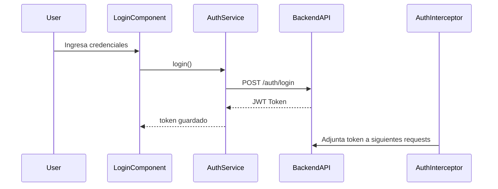

# Arquitectura y Patrones de Diseño

## 🧠 Arquitectura General del Sistema

El sistema está dividido en dos aplicaciones principales:

1. **Backend**: API REST construida con Spring Boot.
2. **Frontend**: SPA desarrollada en Angular.

Estas se comunican mediante HTTP a través de servicios autenticados con JWT.

---

## 🧩 Frontend: TaskManagerFrontEnd-main

### ⚙️ Arquitectura Modular Angular

El frontend sigue una arquitectura modular basada en Angular con separación clara de responsabilidades:

* **Core Module (`core`)**: servicios reutilizables, guardias, interceptores.
* **Features (`features/tasks`)**: componentes y páginas para la funcionalidad de tareas.
* **Modules (`modules/auth`)**: módulos de autenticación (login/registro).
* **Store (`store`)**: estado global de la aplicación gestionado con NgRx o patrón similar.

### 📁 Estructura de Carpetas

* `core/guards/auth.guard.ts`: protege rutas de acceso si el usuario no está autenticado.
* `core/interceptors/auth.interceptor.ts`: adjunta el token JWT a cada request HTTP.
* `core/services/auth.service.ts`, `tasks.service.ts`: servicios para lógica de negocio.
* `features/tasks`: contiene componentes de tareas (páginas y modales).
* `modules/auth`: contiene páginas de login y registro.
* `store/auth`: gestión del estado de autenticación (acciones y reducers).

### 🔄 Flujo de Autenticación

---

## 🧱 Patrones de Diseño en el Frontend

### 1. **Modularización Angular**

* Separación por responsabilidades en módulos (`core`, `features`, `modules`).

### 2. **Dependency Injection (DI)**

* Servicios (`AuthService`, `TasksService`) son inyectados en componentes y guardias.

### 3. **Interceptor Pattern**

* `AuthInterceptor` actúa como interceptor HTTP para insertar el token JWT en las cabeceras.

### 4. **Reactive Forms y Observables**

* Uso de `RxJS` para manejar respuestas asincrónicas desde el backend.

### 5. **State Management (Redux-like)**

* Se implementa un patrón tipo Redux en `store/auth` con `actions` y `reducers`.

---

## 🧠 Comunicación Frontend - Backend

* El frontend llama a los endpoints del backend autenticado mediante JWT.
* Los tokens se gestionan en el `AuthService` y se propagan con `AuthInterceptor`.

---
