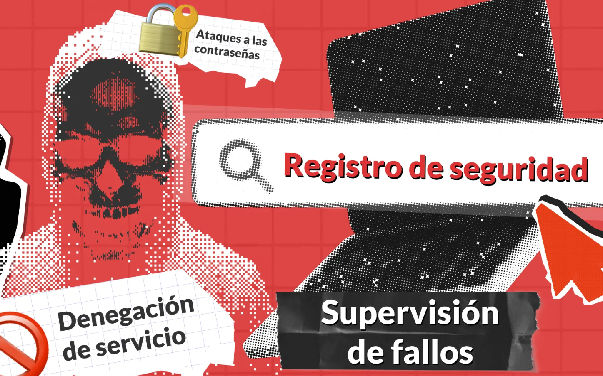

# Trabajo del Grupo 3

## Tema: OWASP Top 10 – Principales Riesgos de Seguridad en Aplicaciones Web
https://microhackers.net/wp-content/uploads/2021/09/owasp-logo.png

### - Desarrollo del Tema

El **OWASP Top 10** es una lista reconocida a nivel mundial que identifica los 10 principales riesgos de seguridad en aplicaciones web. Es mantenida por la comunidad de OWASP (Open Worldwide Application Security Project) y sirve como referencia para desarrolladores, analistas y equipos de seguridad.

Nació como un proyecto colaborativo para compartir buenas prácticas en desarrollo seguro.

---
### - Historia de OWASP

OWASP fue fundada en 2001 por Mark Curphey y desde entonces se ha convertido en una de las principales referencias en seguridad de aplicaciones. Con el tiempo, ha crecido hasta incluir una comunidad activa de voluntarios y expertos en seguridad en todo el mundo.

**Comportamiento ético**
Las actividades, programas y eventos de la Fundación se ajustan a diversas políticas establecidas en nuestras Políticas y Procedimientos y el Código de Conducta . Además, esperamos que nuestros miembros de la Junta Directiva, líderes, personal y voluntarios sean un ejemplo de integridad, honestidad y paciencia al apoyar a nuestras comunidades.

### **Línea del tiempo de OWASP:**

**2001 – Fundación de OWASP:**
Creado por Mark Curphey , con el objetivo de ofrecer recursos gratuitos y abiertos relacionados con la seguridad en aplicaciones web.

**2003 – Primer Top 10 de OWASP:**
Publicación inicial del OWASP Top 10 , una lista de las 10 principales vulnerabilidades de seguridad en aplicaciones web.

**2004-2007 – Expansión global:**
Creación de capítulos locales en distintas ciudades y países.
Se realizaron los primeros OWASP AppSec Conferences.
Se lanzan herramientas como WebGoat , una aplicación vulnerable intencionadamente para fines de enseñanza.
Se convirtió en un estándar de facto en la industria para comprender y mitigar los riesgos críticos.
OWASP se constituye como fundación sin fines de lucro.

**2010-2013 – Consolidación como referencia en la industria:**
OWASP Top 10 se actualiza regularmente (2010 y 2013).
OWASP gana aún más tracción entre desarrolladores, empresas y gobiernos.

**2015-2021 – Más proyectos y educación:**
Se amplía el catálogo de proyectos OWASP:
OWASP ZAP (herramienta de análisis dinámico de seguridad).
ASVS (Estándar de verificación de seguridad de aplicaciones).
Hojas de trucos , Guía de pruebas , entre otros.
Se actualiza el Top 10 en 2017 y luego en 2021 , reflejando las nuevas tendencias en amenazas como APIs inseguras o fallos en la arquitectura.

**Años posteriores**
OWASP ha ido expandiendo sus proyectos y recursos, incluyendo el OWASP ASVS (Estándar de Verificación de Seguridad de Aplicaciones), el OWASP Mobile Top 10, y el OWASP API Security Top 10

**Actualmente**
OWASP es una comunidad global de expertos y profesionales que trabajan para mejorar la seguridad del software

---
### - A continuación, se presenta un resumen de los riesgos identificados en la versión más reciente (OWASP Top 10 - 2021):
---
### 1. **Broken Access Control:**
Fallas que permiten a los usuarios actuar fuera de sus permisos, como acceder a datos o funciones restringidas.

#### **Descripción :** 
Ocurre cuando los usuarios pueden actuar fuera de sus permisos previstos.
#### **Causas :**
Falta de validación en el servidor, controles de acceso mal configurados.
#### **Impacto :**
Acceso no autorizado a datos o funciones administrativas.

### **Métodos de explotación :**
Modificación de la URL (por ejemplo, cambiar el ID en una ruta).
Uso de herramientas como Burp Suite para manipular aplicaciones.

### **Mitigación :** 
- Aplicar control de acceso en el servidor.
- Seguir el principio de menor privilegio.
- Validación y autorización robusta en cada solicitud.
---
#### 2. **Cryptographic Failures:**
Problemas relacionados con la protección de datos, como el uso de algoritmos débiles o mala gestión de claves.

#### **Descripción :**
Uso incorrecto o débil de criptografía.
#### **Causas :**
Algoritmos inseguros, falta de cifrado de datos sensibles.
#### **Impacto :**
Pérdida de confidencialidad e integridad.

### **Métodos de explotación :**
Ataques de fuerza bruta sobre hashes débiles.
Robo de datos debido a falta de cifrado en tránsito (por ejemplo, uso de HTTP en vez de HTTPS).

### **Mitigación :**
- Usar HTTPS.
- Evitar algoritmos como MD5 o SHA1.
- Cifrar todos los datos sensibles en tránsito y en reposo.
---
#### 3. **Injection:**
Ataques como SQL Injection que permiten ejecutar comandos maliciosos a través de entradas no validadas.
---
#### 4. **Insecure Design:**
Diseños de sistemas que no consideran la seguridad desde el inicio del desarrollo.
---
#### 5. **Security Misconfiguration:** 
**Configuraciones inseguras en servidores, frameworks o software que abren puertas a atacantes.**
La configuración incorrecta de seguridad se refiere a vulnerabilidades derivadas de configuraciones incorrectas en aplicaciones web, servidores, bases de datos u otros componentes de una infraestructura de TI. Estas configuraciones incorrectas pueden ocurrir en cualquier nivel de la pila de aplicaciones, incluyendo configuraciones predeterminadas, funciones innecesarias o controles de seguridad deficientes, como contraseñas predeterminadas o instancias de bases de datos abiertas. Cuando los sistemas no están configurados de forma segura, se vuelven vulnerables a ataques, lo que permite accesos no autorizados, filtraciones de datos y otros incidentes de seguridad. Una configuración correcta es crucial para mantener la integridad, la confidencialidad y la disponibilidad de una aplicación.

---
#### 6. **Vulnerable and Outdated Components:**
**Uso de librerías, dependencias o sistemas obsoletos con vulnerabilidades conocidas.**
Los componentes vulnerables y obsoletos son bibliotecas o frameworks de terceros utilizados en aplicaciones web que presentan vulnerabilidades conocidas o que ya no reciben soporte de sus desarrolladores. Estos componentes pueden ser explotados por atacantes para obtener acceso no autorizado a datos confidenciales o tomar el control del sistema.

**Los riesgos de utilizar componentes vulnerables y obsoletos**
El uso de componentes vulnerables y obsoletos puede suponer riesgos significativos para las aplicaciones web. Los atacantes pueden explotar estas vulnerabilidades para lanzar ataques como inyección SQL, secuencias de comandos entre sitios (XSS), ejecución remota de código, etc.
**¿Cómo podemos mitigar estos riesgos?**
Para mitigar los riesgos del uso de componentes vulnerables y obsoletos, es fundamental mantenerlos actualizados. Esto implica revisar periódicamente las actualizaciones o parches de seguridad de los desarrolladores del componente y aplicarlos con prontitud.
Además, es fundamental utilizar únicamente componentes que reciban mantenimiento activo de sus desarrolladores. Esto garantiza que cualquier vulnerabilidad recién descubierta se solucione con prontitud.

Además, si estos componentes ya no reciben soporte de sus desarrolladores, podrían no recibir actualizaciones de seguridad ni parches para las vulnerabilidades recién descubiertas, lo que los deja expuestos a la explotación durante un período prolongado.

---
## 🛡️ 7. Identification and Authentication Failures

> **Descripción**  
Este tipo de vulnerabilidad ocurre cuando los mecanismos de autenticación o identificación de los usuarios no están correctamente implementados. Puede permitir que atacantes suplanten la identidad de otros usuarios o accedan a cuentas sin autorización.

### 🔍 ¿Qué son las fallas de identificación y autenticación?

Se presentan cuando:

- Se usan contraseñas débiles o por defecto.
- No hay control de bloqueo después de múltiples intentos fallidos.
- Las sesiones no se invalidan correctamente tras el cierre de sesión.

### 🎯 Riesgos

Estas fallas pueden provocar:

- Acceso no autorizado a cuentas.
- Robo de información sensible.

### 💡 Buenas prácticas para mitigarlas

- Implementar autenticación multifactor (MFA).
- Requerir contraseñas fuertes y únicas.
- Limitar intentos de inicio de sesión (protección contra fuerza bruta).
- 
### 🖼️ Ejemplo gráfico

> *Imagen: Representación de una autenticación fallida y sus consecuencias.*

---
## 🧩 8. Software and Data Integrity Failures

> **Descripción**  
Esta vulnerabilidad ocurre cuando las aplicaciones no verifican la integridad del software, bibliotecas externas o datos críticos, lo que puede ser aprovechado por atacantes para introducir código malicioso o manipular información sensible.

### ❗ ¿Qué significa esto?

Se produce cuando:

- Se instalan actualizaciones automáticas sin verificación de firma digital.
- Se cargan librerías o plugins desde fuentes no confiables.
- No se valida la integridad de archivos de configuración o scripts críticos.

### 🔥 Riesgos

Estas fallas pueden permitir:

- Ejecución remota de código malicioso.
- Manipulación de datos o configuración crítica.

### 🛠️ Buenas prácticas para mitigarlas

- Firmar y verificar todas las actualizaciones de software.
- Validar integridad de dependencias (checksums, firmas).
- Implementar DevSecOps con verificación continua de integridad.

---
#### 9. **Security Logging and Monitoring Failures:**
(Fallas de registro y monitoreo de seguridad), 
Las fallas de registro y monitoreo de seguridad son vulnerabilidades que pueden ocurrir cuando un sistema o aplicación no registra o monitorea correctamente los eventos de seguridad. Esto puede permitir que atacantes obtengan acceso no autorizado a sistemas y datos sin ser detectados. 

##### **Mitigación**

- Registrar todos los eventos de aplicacion
- Proteger los eventos logs contra posibles atacantes
- Establecer alertas para todo tipo de evento dentro de app.
---
#### 10. **Server-Side Request Forgery (SSRF):**
(Falsificación de solicitud del lado del servidor), 
En un ataque de Falsificación de Solicitudes del Lado del Servidor (SSRF), el atacante puede proporcionar o manipular una URL para que el código ejecutado en el servidor lea y envíe datos a una ubicación elegida por el atacante. Esta vulnerabilidad puede resultar en el robo o pérdida de datos e información sensible, ya que el atacante puede conectarse a servicios internos de la organización y a sistemas externos no deseados.

##### **Mitigación**
- Establecer una URL fija
- Incluir en una lista blanca el nombre, las direcciones IP o los nombres DNS
- Implementar reglas de Firewall que eviten el tráfico no deseado entre servidores

---

#### ¿Por qué es importante?

- Proteger aplicaciones web ante los riesgos más comunes y peligrosos.
- Cumplir con normativas y estándares de seguridad.
- Concientizar a los desarrolladores y fomentar buenas prácticas de codificación segura.

---

[Documentación oficial de owasp](https://owasp.org/www-project-devsecops-guideline/)

---
> "La seguridad no es un producto, es un proceso." - Bruce Schneier
---

[Ver video sobre owasp](https://www.youtube.com/watch?v=vf9Waxh3I04)

----

---

### Integrantes del Grupo

- Sara Sofía Moreno
- Juan Camilo Cristiano
- Yonatan Castellanos  
- Luis Alejandro Romero
- Marlon Artunduaga
