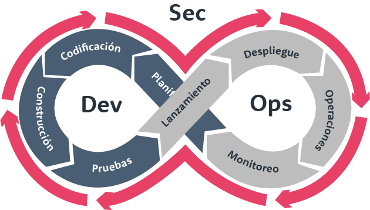

# Trabajo del Grupo 3

## Tema: DevSecOps – Seguridad Integrada en el Ciclo de Desarrollo

### Desarrollo del Tema

DevSecOps es la evolución del enfoque DevOps que incorpora la seguridad como una parte fundamental del ciclo de vida del desarrollo de software. En lugar de tratar la seguridad como una etapa final, DevSecOps promueve su integración desde el principio, durante todo el proceso de desarrollo y despliegue.

#### ¿Por qué es importante?

- **Prevención temprana de vulnerabilidades**: Detectar fallos de seguridad durante la codificación es más barato y rápido que al final.
- **Automatización de la seguridad**: Herramientas como análisis de código estático, escaneo de dependencias y gestión de secretos permiten asegurar los pipelines de CI/CD sin frenar el flujo de trabajo.
- **Cultura colaborativa**: Desarrolladores, operaciones y especialistas en seguridad trabajan en conjunto desde el inicio del proyecto.

#### Herramientas comunes en DevSecOps

- **Snyk** o **Dependabot** para escaneo de vulnerabilidades en dependencias.
- **SonarQube** para análisis de calidad y seguridad del código.
- **Trivy**, **Aqua Security**, **Checkov** para escaneo de contenedores e infraestructura como código.
- **GitHub Actions**, **GitLab CI/CD**, **Jenkins** con integraciones de seguridad automatizadas.

#### Beneficios

- Reducción de riesgos y costos.
- Mayor confianza en las entregas.
- Respuesta más rápida a vulnerabilidades.

### Integrantes del Grupo

- Sara Sofía  
- Juan Camilo  Cristiano
- Jhonatan  
- Luis Alejandro Ricardo
- Marlon Artunduaga

