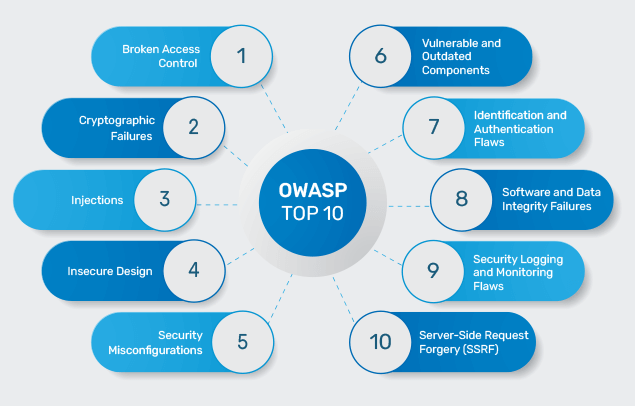

# Trabajo del Grupo 3

## Tema: OWASP Top 10 – Principales Riesgos de Seguridad en Aplicaciones Web

### Desarrollo del Tema

El **OWASP Top 10** es una lista reconocida a nivel mundial que identifica los 10 principales riesgos de seguridad en aplicaciones web. Es mantenida por la comunidad de OWASP (Open Worldwide Application Security Project) y sirve como referencia para desarrolladores, analistas y equipos de seguridad.

A continuación, se presenta un resumen de los riesgos identificados en la versión más reciente (OWASP Top 10 - 2021):

#### 1. **Broken Access Control**
Fallas que permiten a los usuarios actuar fuera de sus permisos, como acceder a datos o funciones restringidas.

#### 2. **Cryptographic Failures**
Problemas relacionados con la protección de datos, como el uso de algoritmos débiles o mala gestión de claves.

#### 3. **Injection**
Ataques como SQL Injection que permiten ejecutar comandos maliciosos a través de entradas no validadas.

#### 4. **Insecure Design**
Diseños de sistemas que no consideran la seguridad desde el inicio del desarrollo.

#### 5. **Security Misconfiguration**
Configuraciones inseguras en servidores, frameworks o software que abren puertas a atacantes.

#### 6. **Vulnerable and Outdated Components**
Uso de librerías, dependencias o sistemas obsoletos con vulnerabilidades conocidas.

#### 7. **Identification and Authentication Failures**
Errores en la autenticación de usuarios que pueden permitir suplantación de identidad.

#### 8. **Software and Data Integrity Failures**
Falta de validación de integridad del software o datos, como actualizaciones no verificadas.

#### 9. **Security Logging and Monitoring Failures**
Ausencia de registros de seguridad y alertas, lo que retrasa la detección de ataques.

#### 10. **Server-Side Request Forgery (SSRF)**
Vulnerabilidades que permiten a un atacante hacer que el servidor realice solicitudes no autorizadas.

#### ¿Por qué es importante?

- Proteger aplicaciones web ante los riesgos más comunes y peligrosos.
- Cumplir con normativas y estándares de seguridad.
- Concientizar a los desarrolladores y fomentar buenas prácticas de codificación segura.

---

### Integrantes del Grupo

- Sara Sofía  
- Juan Camilo  
- Jhonatan  
- Luis Alejandro  
- Marlon Artunduaga

