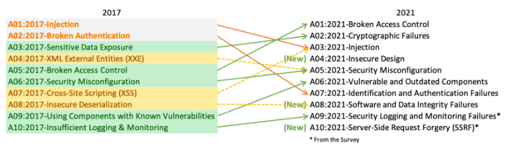
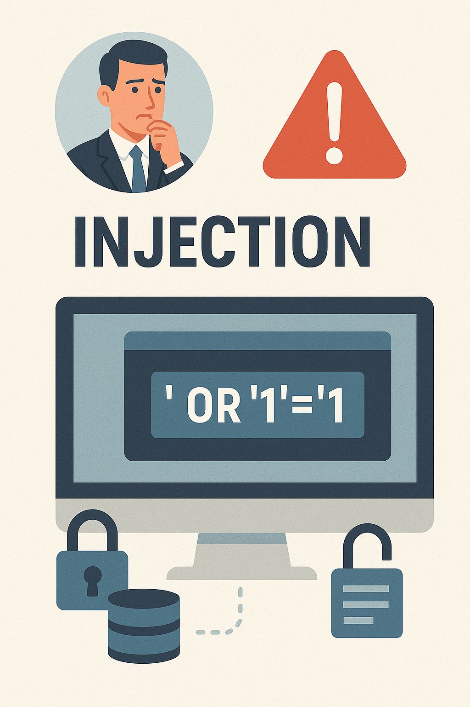
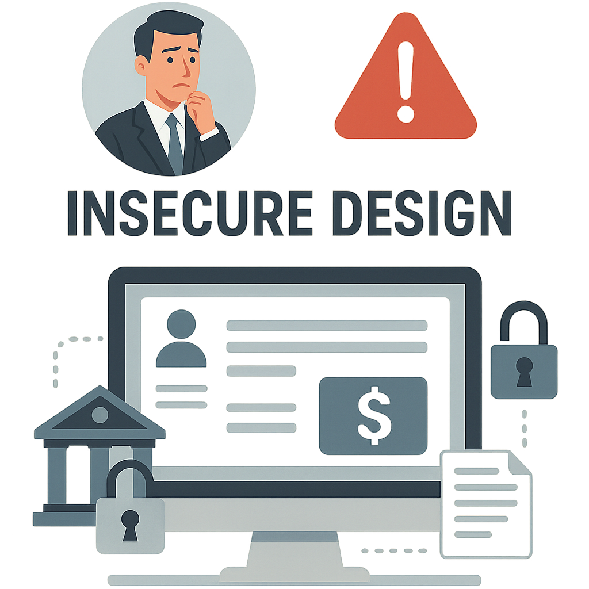

  <h1>OWASP</h1>

### ¿Qué es OWASP?

OWASP (Open Worldwide Application Security Project) es una comunidad global sin fines de lucro enfocada en mejorar la seguridad del software. Proporciona recursos, herramientas, documentación y estándares abiertos para ayudar a organizaciones y desarrolladores a construir aplicaciones seguras.

### ¿Qué es el OWASP Top 10?

El OWASP Top 10 es un proyecto que identifica las diez vulnerabilidades de seguridad más críticas en aplicaciones web. Es ampliamente reconocido como un estándar para la concientización sobre seguridad en el desarrollo de software, su última versión es del año 2021 agregando tres nuevas categorias con cambios de nombres y alcances en algunas de ellas.

  <h1>Top 10 (2021)</h1>

### ¿Qué ha cambiado en el Top 10 para 2021?

Hay tres categorías nuevas, cuatro categorías con cambios de nombre y alcance, y cierta consolidación en el Top 10 para 2021. Hemos cambiado los nombres cuando fue necesario para 
centrarnos en la causa raíz en lugar del síntoma.

### A01:2021 – Pérdida de Control de Acceso

**Descripción:**  

Se produce cuando los usuarios pueden realizar acciones fuera de sus permisos intencionados. Suele deberse a falta de validaciones del lado del servidor.

**Métodos de explotación:**

- Forzar URLs (path traversal).
- Cambiar parámetros de usuario (por ejemplo, IDs).
- Uso de herramientas como Burp Suite para modificar solicitudes HTTP.

**Ejemplo:**  

Un atacante cambia su ID de usuario en una URL (`/user/12345`) a otro (`/user/67890`) y accede a la información de otra persona.

**Prevención y mitigación:**

- Implementar controles de acceso del lado del servidor.
- Aplicar el principio de mínimos privilegios.
- Auditorías frecuentes de reglas de acceso.

### A02:2021 – Fallas Criptográficas

**Descripción:**  

Exposición de datos sensibles debido a cifrado incorrecto o inexistente.

**Métodos de explotación:**

- Interceptar datos con sniffers (como Wireshark).
- Explotar almacenamiento sin cifrar.

**Ejemplo:**  

Una app almacena contraseñas en texto plano, permitiendo que un atacante que accede a la DB vea todas las credenciales.

**Prevención y mitigación:**

- Usar HTTPS con TLS moderno (TLS 1.2+).
- Cifrar datos en reposo y en tránsito.
- Hash de contraseñas con bcrypt, scrypt, o Argon2.

### A03:2021 – Inyección de Código

**Descripción:**  

Una aplicación es vulnerable a ataques cuando:

-   Los datos proporcionados por el usuario no son validados, filtrados ni desinfectados por la aplicación.
- Las consultas dinámicas o llamadas no parametrizadas sin escape consciente del contexto se utilizan directamente en el intérprete.
- Los datos hostiles se utilizan dentro de los parámetros de búsqueda de mapeo relacional de objetos (ORM) para extraer registros confidenciales adicionales.
- Los datos hostiles se utilizan directamente o se concatenan. El SQL o comando contiene la estructura y los datos maliciosos en consultas dinámicas, comandos o procedimientos almacenados.

Algunas de las inyecciones más comunes son SQL, NoSQL, comandos del sistema operativo, mapeo relacional de objetos (ORM), LDAP y lenguaje de expresión (EL) u biblioteca de navegación de gráficos de objetos (OGNL). El concepto es idéntico en todos los intérpretes. La revisión del código fuente es el mejor método para detectar si las aplicaciones son vulnerables a inyecciones. Se recomienda encarecidamente realizar pruebas automatizadas de todos los parámetros, encabezados, URL, cookies, JSON, SOAP y datos XML. Las organizaciones pueden incluir herramientas de pruebas de seguridad de aplicaciones estáticas (SAST), dinámicas (DAST) e interactivas (IAST) en el flujo de trabajo de CI/CD para identificar las vulnerabilidades de inyección introducidas antes de la implementación en producción.

**Métodos de explotación:**

1. **SQL Injection (Inyección SQL)**
Es el tipo más conocido. Ocurre cuando un atacante inserta sentencias SQL maliciosas en campos de entrada de datos, buscando que se ejecuten en la base de datos.
**Impacto:** Pérdida de confidencialidad, corrupción o destrucción de datos, acceso no autorizado.

2. **Command Injection (Inyección de comandos del sistema operativo)**

Permite al atacante ejecutar comandos arbitrarios del sistema operativo.
**Impacto:** Toma de control del sistema, eliminación de archivos, ejecución de malware.

3. **LDAP Injection**

Manipula las consultas al servidor LDAP para filtrar o alterar datos.
**Impacto:** Acceso no autorizado a datos de directorios, suplantación de identidad.

4. **XPath Injection**
Altera las consultas XPath para acceder o modificar datos en documentos XML.
**Impacto:** Lectura no autorizada de datos XML.

5. **NoSQL Injection**
Dirigido a bases de datos NoSQL como MongoDB.
**Impacto:** Acceso no autorizado a documentos, alteración de registros.

**Ejemplo:**  

- **Escenario n.° 1:** Una aplicación utiliza datos no confiables en la construcción de la siguiente llamada SQL vulnerable:

    String query = "SELECT \* FROM accounts WHERE custID='" + request.getParameter("id") + "'";

- **Escenario n.° 2:** De manera similar, la confianza ciega de una aplicación en los marcos puede generar consultas que aún sean vulnerables (por ejemplo, Hibernate Query Language (HQL)):

    Query HQLQuery = session.createQuery("FROM accounts WHERE custID='" + request.getParameter("id") + "'");

En ambos casos, el atacante modifica el valor del parámetro 'id' en su navegador para enviar: 'UNION SLEEP(10);--. Por ejemplo:

    http://example.com/app/accountView?id=' UNION SELECT SLEEP(10);--

Esto cambia el significado de ambas consultas para devolver todos los registros de la tabla de cuentas. Ataques más peligrosos podrían modificar o eliminar datos o incluso invocar procedimientos almacenados.

**Prevención y mitigación:**

Para evitar la inyección es necesario mantener los datos separados de los comandos y las consultas:

- La opción preferida es usar una API segura que evite el uso del intérprete por completo, proporcione una interfaz parametrizada o migre a herramientas de mapeo relacional de objetos (ORM).
**Nota:** Incluso parametrizados, los procedimientos almacenados pueden introducir una inyección SQL si PL/SQL o T-SQL concatenan consultas y datos o ejecutan datos hostiles con EXECUTE IMMEDIATE o exec().

- Utilice la validación de entrada positiva del lado del servidor. Esto no constituye una defensa completa, ya que muchas aplicaciones requieren caracteres especiales, como áreas de texto o API para aplicaciones móviles.

- Para cualquier consulta dinámica residual, escape los caracteres especiales utilizando la sintaxis de escape específica de ese intérprete.
**Nota:** Las estructuras SQL, como nombres de tablas y columnas, no se pueden escapar, por lo que los nombres de estructura proporcionados por el usuario son peligrosos. Este es un problema común en el software de generación de informes.

- Utilice LIMIT y otros controles SQL dentro de las consultas para evitar la divulgación masiva de registros en caso de inyección SQL.

### A04:2021 – Diseño Inseguro

**Descripción:**  

El diseño inseguro es una categoría amplia que representa diferentes debilidades, expresadas como un diseño de control ineficaz o ausente. Este diseño no es la fuente de las demás 10 categorías de riesgo principales. Existe una diferencia entre el diseño inseguro y la implementación insegura. Distinguimos entre fallas de diseño y defectos de implementación por una razón: tienen diferentes causas y soluciones. Un diseño seguro puede presentar defectos de implementación que generen vulnerabilidades susceptibles de ser explotadas. Un diseño inseguro no se puede solucionar con una implementación perfecta, ya que, por definición, nunca se crearon los controles de seguridad necesarios para defenderse de ataques específicos. Uno de los factores que contribuye al diseño inseguro es la falta de un perfil de riesgos empresariales inherente al software o sistema en desarrollo y, por lo tanto, la imposibilidad de determinar el nivel de seguridad requerido.

**Métodos de explotación:**

1. **Ausencia de controles de autorización**
Si no se diseña un control adecuado de qué usuarios pueden hacer qué acciones, se pueden realizar operaciones críticas sin permiso.
**Impacto:** Acceso indebido a funcionalidades, escalación de privilegios, eliminación o modificación de datos.

2. **Flujos inseguros o mal definidos**
Diseños que no contemplan los diferentes escenarios de uso o malicia pueden permitir eludir pasos críticos de seguridad.
**Impacto:** Suplantación de identidad, acceso a cuentas ajenas.

3. **No separación de funciones (SoD – Segregation of Duties)**
Una única cuenta o rol puede realizar todas las operaciones sin límites, lo cual va contra principios de control interno.
**Impacto:** Fraudes internos, movimientos no autorizados.

4. **Configuraciones por defecto inseguras**
Diseños que no obligan a cambiar contraseñas por defecto o no exigen configuraciones seguras iniciales.
**Impacto:** Acceso completo no autorizado desde el primer momento.

5. **No considerar amenazas específicas en el diseño**
No tener en cuenta posibles vectores como ataques de fuerza bruta, carga masiva de archivos o denegación de servicio.
**Impacto:** Ataques automatizados, abuso de recursos.

6. **Falta de cifrado en diseño**
Diseñar procesos que no contemplan la protección de datos en tránsito o en reposo.
**Impacto:** Exposición de credenciales, robo de datos sensibles.

7. **Diseño que expone lógica de negocio**
No proteger adecuadamente los flujos críticos, permitiendo que un atacante entienda y manipule la lógica.
**Impacto:** Alteración de precios, manipulación de inventarios, fraudes.

**Ejemplo:**  

**Escenario n.° 1:** Un flujo de trabajo de recuperación de credenciales podría incluir preguntas y respuestas, lo cual está prohibido por NIST 800-63b, OWASP ASVS y OWASP Top 10. No se puede confiar en las preguntas y respuestas como prueba de identidad, ya que más de una persona puede conocerlas, por lo que están prohibidas. Este tipo de código debería eliminarse y reemplazarse por un diseño más seguro.

**Escenario n.° 2:** Una cadena de cines ofrece descuentos por reserva de grupo y tiene un máximo de quince asistentes antes de exigir un depósito. Los atacantes podrían modelar este flujo y probar si pueden reservar seiscientas butacas y todos los cines a la vez con unas pocas solicitudes, lo que provocaría una pérdida masiva de ingresos.

**Escenario n.° 3:** El sitio web de comercio electrónico de una cadena minorista no cuenta con protección contra bots administrados por revendedores que compran tarjetas de video de alta gama para revenderlas en sitios web de subastas. Esto genera una mala publicidad para los fabricantes de tarjetas de video y los propietarios de las cadenas minoristas, además de generar una persistente hostilidad con los aficionados que no pueden obtener estas tarjetas a ningún precio. Un diseño antibots cuidadoso y reglas de lógica de dominio, como las compras realizadas a los pocos segundos de estar disponibles, podrían identificar compras no auténticas y rechazar dichas transacciones.

**Prevención y mitigación:**

- Establecer y utilizar un ciclo de vida de desarrollo seguro con profesionales de AppSec para ayudar a evaluar y diseñar controles relacionados con la seguridad y la privacidad.

- Establecer y utilizar una biblioteca de patrones de diseño seguros o componentes de carreteras pavimentadas listos para usar

- Utilice el modelado de amenazas para la autenticación crítica, el control de acceso, la lógica empresarial y los flujos de claves.

- Integrar lenguaje y controles de seguridad en las historias de usuario

- Integre comprobaciones de plausibilidad en cada nivel de su aplicación (desde el frontend hasta el backend)

- Redacte pruebas unitarias y de integración para validar que todos los flujos críticos sean resistentes al modelo de amenazas. Recopile casos de uso y casos de uso indebido para cada nivel de su aplicación.

- Segregar capas de niveles en las capas del sistema y de la red según las necesidades de exposición y protección

- Segregar a los inquilinos de forma sólida mediante diseño en todos los niveles

- Limitar el consumo de recursos por usuario o servicio

### A05:2021 – Configuración de Seguridad Incorrecta

**Descripción:**  
Malas configuraciones de servidores, servicios en la nube, frameworks, permisos, etc.

**Métodos de explotación:**
- Acceso a consolas de administración sin autenticación.
- Exposición de paneles de debug.
- Escaneo con herramientas como Nikto, Nmap.

**Ejemplo:**  
Un servidor expone la consola de administración de Jenkins sin protección.

**Prevención y mitigación:**
- Deshabilitar funciones innecesarias.
- Configurar correctamente cabeceras HTTP.
- Automatizar revisiones de configuración y despliegue seguro (IaC con seguridad).

### A06:2021 – Componentes Vulnerables y Desactualizados

**Descripción:**  
Uso de librerías, dependencias o sistemas con vulnerabilidades conocidas sin aplicar parches.

**Métodos de explotación:**
- Explotar CVEs conocidas.
- Uso de herramientas como Dependabot, OWASP Dependency-Check, o Retire.js.

**Ejemplo:**  
Una app usa Log4j sin parchear, vulnerable a Log4Shell.

**Prevención y mitigación:**
- Mantener dependencias actualizadas.
- Monitorizar CVEs y boletines de seguridad.
- Usar herramientas de análisis de componentes (SCA).

### A07:2021 – Fallos de Autenticación e Identificación

**Descripción:**  
Debilidades en el control de acceso a cuentas, sesiones, contraseñas o MFA.

**Métodos de explotación:**
- Ataques de fuerza bruta, credential stuffing.
- Robo de tokens de sesión.
- Herramientas: Hydra, Burp Intruder.

**Ejemplo:**  
No hay límite de intentos de login → se prueba un diccionario de contraseñas.

**Prevención y mitigación:**
- Implementar MFA.
- Bloqueo tras varios intentos fallidos.
- Hashing robusto de contraseñas.
- Manejo seguro de sesiones (timeouts, regeneración de tokens).

### A08:2021 – Fallas de Integridad de Software y Datos

**Descripción:**  
Uso de código, actualizaciones o datos sin verificar su integridad. Incluye CI/CD inseguros.

**Métodos de explotación:**
- Ataques a la cadena de suministro.
- Manipulación de archivos durante descarga o actualización.

**Ejemplo:**  
Una app descarga una librería de un sitio externo sin verificar su firma digital.

**Prevención y mitigación:**
- Verificar integridad con firmas digitales.
- CI/CD seguros con controles de seguridad y análisis automático.
- Firmar y validar scripts de infraestructura.

### A09:2021 – Fallas de Registro y Monitoreo de Segurida

**Descripción:**  

Se refieren a la incapacidad de una aplicación para registrar, detectar y responder adecuadamente a eventos de seguridad. Esto incluye desde intentos de acceso no autorizados hasta errores críticos que podrían indicar un ataque en curso.

Cuando no se registran estos eventos o no se monitorean activamente, se pierde visibilidad sobre lo que ocurre dentro del sistema, lo que permite que los atacantes operen sin ser detectados durante largos períodos.

Este riesgo incluye fallos como:

- No registrar eventos importantes como inicios de sesión, accesos denegados, errores del servidor o cambios de configuración.

- No generar alertas cuando ocurren eventos sospechosos o críticos.

- No conservar registros de manera segura o por el tiempo necesario.

- No contar con un plan de respuesta ante incidentes detectados por logs o alertas.

  **Ejemplos:**

  **Escenario n.° 1:** Un atacante accede a una URL restringida (por ejemplo, /admin/panel) sin autenticarse. El sistema responde con un 
  error 403 (prohibido), pero no registra el intento de acceso no autorizado.

  **Riesgo:** Sin este registro, los intentos de reconocimiento o acceso indebido pasan desapercibidos. Esto puede ser parte de una etapa 
  temprana de un ataque más grande, como el reconocimiento previo a la explotación.

  **Accion recomendada:** Registrar todos los accesos denegados y generar alertas si se detectan múltiples intentos desde la misma IP o 
  usuario.

  **Escenario n.° 2:** La aplicación intenta guardar un nuevo usuario en la base de datos, pero ocurre un error (por ejemplo, duplicado 
  enun campo único). El sistema muestra un mensaje genérico al usuario, pero no registra el error.

  **Riesgo:** Este tipo de errores puede indicar una mala validación del lado del servidor o incluso un intento de inyección. No tener 
  visibilidad de los errores limita la capacidad de respuesta y la mejora continua del sistema.

  **Accion recomendada:** Registrar todos los errores del sistema con suficiente contexto (usuario, IP, timestamp, módulo afectado) y 
  monitorear patrones de fallos frecuentes.

  

### A10:2021 – Falsificación de Solicitud del Lado del Servidor (SSRF)

**Descripción:**  

Esta ocurre cuando una aplicación web permite que un atacante envíe solicitudes arbitrarias desde el servidor hacia recursos internos o externos, explotando funcionalidades como carga de imágenes, validación de URLs, llamadas HTTP a servicios internos, etc.

Este riesgo incluye fallos como:

- Acceder a metadatos del servidor en la nube (por ejemplo, `http://169.254.169.254` en AWS).
  
- Enumerar servicios internos y escanear puertos.
  
- Acceder a bases de datos internas o APIs privadas.
  
- Escalar privilegios o pivotar hacia otros sistemas.

  

  **Ejemplos:**

  **Escenario n.° 1:** La aplicación permite al usuario subir una imagen desde una URL. El atacante ingresa como URL:  
  `http://169.254.169.254/latest/meta-data/`  (servidor de metadatos en Amazon EC2).

  **Riesgo:** Se exfiltran claves, tokens o configuraciones sensibles del entorno cloud.

  **Accion recomendada:** Validar las URLs contra una lista blanca de dominios externos seguro y bloquear el acceso a IPs internas

  **Escenario n.° 2:** Un formulario permite probar conexiones a una URL ingresada por el usuario. El atacante envía múltiples 
  solicitudes hacia IPs internas (`192.168.x.x`, `127.0.0.1`) y registra las respuestas..

  **Riesgo:** Permite descubrir qué servicios internos están activos, facilitando ataques posteriores.

  **Accion recomendada:** Se pueden Implementar firewalls a nivel de aplicación y utilizar DNS en lugar de IPs directas
  
## Referencias Bibliográficas

- OWASP Foundation. (2021). *OWASP Top 10: The Ten Most Critical Web Application Security Risks*. https://owasp.org/Top10/
- OWASP Foundation. (2021). *OWASP Top 10: Detailed Cheat Sheet*. https://cheatsheetseries.owasp.org/
- PortSwigger Web Security Academy. (s.f.). *Web Security Learning Resources*. https://portswigger.net/web-security
- OWASP Foundation. (2023). *OWASP Application Security Verification Standard (ASVS)*. https://owasp.org/www-project-application-security-verification-standard/
- OWASP Foundation. (s.f.). *OWASP Secure Coding Practices - Quick Reference Guide*. https://owasp.org/www-project-secure-coding-practices-quick-reference-guide/
- OWASP Top 10 – A09:2021 – Security Logging and Monitoring Failures, https://owasp.org/Top10/A09_2021-Security_Logging_and_Monitoring_Failures/
- OWASP Top 10 – A10:2021 – Server-Side Request Forgery (SSRF), https://owasp.org/Top10/A10_2021-Server-Side_Request_Forgery_%28SSRF%29/

## Integrantes

- Diana Lizeth Mahecha Guevara  
- Carlos Andres David Ovalle  
- German Alexis Gonzalez Reay  
- Jairo Yesid Rodriguez Gonzalez  
- Wuilmer Rafael Briceño Camacho
