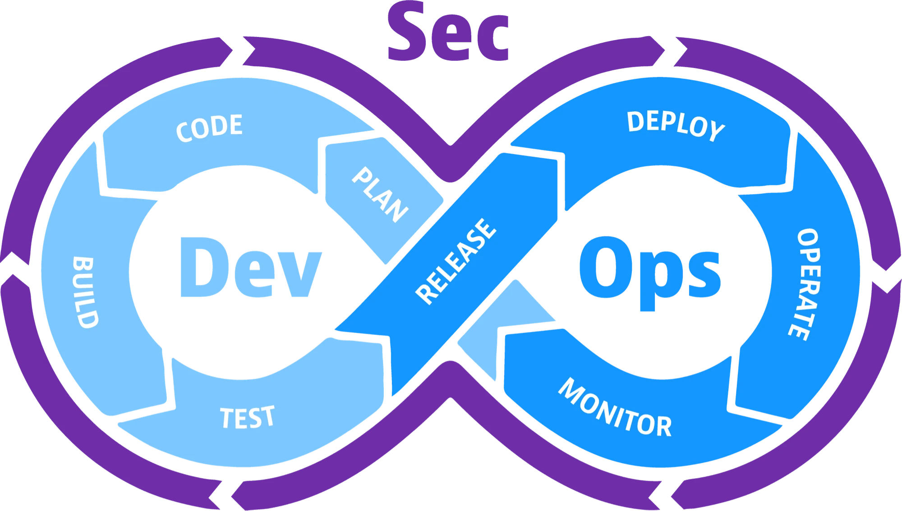

#  Introducción a DevOps y DevSecOps

¿Alguna vez te has preguntado cómo las grandes empresas lanzan software rápido, sin errores y manteniendo la seguridad? La respuesta está en dos prácticas clave: **DevOps** y **DevSecOps**. En esta guía, aprenderás de forma sencilla qué son, cómo funcionan y por qué son tan importantes.

---

##  ¿Qué es DevOps?

**DevOps** es la unión de los equipos de desarrollo y operaciones en un **flujo de trabajo coordinado** que mejora la colaboración y la productividad para alcanzar los objetivos de negocio compartidos. Basándose en Agile y Lean,DevOps permite a la empresa responder a los cambios y satisfacer las necesidades de los clientes con mayor rapidez. Las herramientas y la automatización son facilitadores necesarios. Prácticas como la Integración Continua y la Entrega Continua se suelen implementar.

###  Objetivo principal
- Automatizar procesos.
- Mejorar la colaboración entre equipos.
- Entregar valor continuo al usuario final.

###  Ciclo de vida DevOps

1. **Planificación**: definir qué se va a construir.
2. **Desarrollo**: escribir el código.
3. **Integración continua (CI)**: integrar cambios frecuentemente.
4. **Entrega continua (CD)**: desplegar el software automáticamente.
5. **Monitoreo y operación**: asegurar que todo funcione correctamente.

### Mejores Practicas
Si bien DevOps no es un conjunto de prácticas, lo siguiente puede ayudar a los novatos a adentrarse en el movimiento DevOps:

1. DevOps se centra en las personas, los procesos y las herramientas, en ese orden. Empezar con las herramientas no es la mejor manera de hacerlo.
2. La empatía es importante para comprender las necesidades, romper silos y unir a distintos equipos.
3. Comience con algo pequeño y estratégico y luego aplíquelo a gran escala en toda la organización.
4. Invierta en herramientas que ofrezcan visibilidad en tiempo real. La integración de herramientas es esencial. Si varias herramientas no funcionan bien juntas, la colaboración se verá obstaculizada.
5. Aumente la velocidad de implementación. Para lograrlo, invierta en automatización y aplique técnicas ágiles.
6. Mejore la retroalimentación en cada paso, ya sea la compilación, la implementación, la recuperación o las notificaciones.

---

##  ¿Qué es DevSecOps?

**DevSecOps**, que es la abreviatura de  desarrollo , seguridad  y operaciones , es una práctica de desarrollo de aplicaciones que automatiza la **integración de prácticas de seguridad y protección** en cada fase del ciclo de vida del desarrollo de software, desde el diseño inicial hasta la integración, las pruebas, la entrega y la implementación.

###  ¿Qué agrega DevSecOps?

- Seguridad integrada en todas las etapas.
- Evaluación de riesgos desde el diseño.
- Automatización de pruebas de seguridad.

###  Fases adicionales del ciclo DevSecOps

1. **Evaluación de riesgos**
2. **Pruebas de seguridad (automatizadas y manuales)**
3. **Monitoreo de vulnerabilidades**
4. **Respuesta ante incidentes**

### Beneficios de DevSecOps

Las dos principales ventajas de DevSecOps son **la velocidad y la seguridad**. Por lo tanto, los equipos de desarrollo entregan código mejor y más seguro con mayor rapidez y a un menor coste.

“El propósito y la intención de DevSecOps es construir sobre la base de la mentalidad de que todos son responsables de la seguridad, con el objetivo de distribuir de forma segura las decisiones de seguridad con rapidez y escala a quienes poseen el mayor nivel de contexto, sin sacrificar la seguridad requerida”, describe Shannon Lietz, coautora del “Manifiesto DevSecOps”.

### Mejores prácticas para DevSecOps

DevSecOps debería ser la incorporación natural de controles de seguridad en sus procesos de desarrollo, entrega y operaciones.

1. **Desplazarse a la izquierda:** "Desplazarse a la izquierda" es un mantra de DevSecOps: anima a los ingenieros de software a mover la seguridad del extremo derecho al principio del proceso de DevOps (entrega). En un entorno DevSecOps, la seguridad es parte integral del proceso de desarrollo desde el principio.

2. **Educación en seguridad:** La seguridad es una combinación de ingeniería y cumplimiento normativo. Las organizaciones deben formar una alianza entre los ingenieros de desarrollo, los equipos de operaciones y los de cumplimiento normativo para garantizar que todos en la organización comprendan la postura de seguridad de la empresa y sigan los mismos estándares. Todas las personas involucradas en el proceso de entrega deben estar familiarizadas con los principios básicos de la seguridad de las aplicaciones.

3. **Cultura: Comunicación, personas, procesos y tecnología:** Los equipos de operaciones de DevSecOps deben crear un sistema que les funcione, utilizando las tecnologías y protocolos que mejor se adapten a su equipo y al proyecto actual. Al permitir que el equipo cree el entorno de flujo de trabajo que mejor se adapte a sus necesidades, se convierten en participantes activos en el resultado del proyecto.

4. **Trazabilidad, auditabilidad y visibilidad:** La implementación de trazabilidad, auditabilidad y visibilidad en un proceso DevSecOps conduce a una visión más profunda y a un entorno más seguro.

---

##  DevOps vs DevSecOps

| Característica           | DevOps                         | DevSecOps                          |
|--------------------------|--------------------------------|------------------------------------|
| Enfoque principal        | Entrega rápida y continua      | Entrega rápida y segura            |
| Seguridad                | Se considera al final          | Se incorpora desde el inicio       |
| Automatización           | CI/CD                          | CI/CD + pruebas de seguridad       |
| Herramientas             | Jenkins, Docker, Git           | Jenkins, Docker, Git, SAST, DAST   |
| Cultura                  | Colaboración Dev + Ops         | Colaboración Dev + Ops + Sec       |
